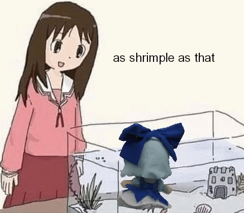

# ShOGLE

<div align="center">
    <picture>
        
    </picture>
    <h4>Shrimple OpenGL Engine</h4>
</div>

Funny C++20 graphics framework made for my personal projects. Includes basic functions and
classes to create a program with GPU accelerated 2D or 3D graphics.

*(yes I rendered the GIF using the engine)*

## Features
- OpenGL 4.3+ backend with state wrappers
- Linear algebra library
- Window creation (using GLFW)
- Dear ImGUI integration
- Some basic STL utillities

#### Planned features
- Vulkan backend 
- Software renderer backend
- More complex rendering systems (fonts, lighting, ...)
- Compute pipeline
- Compile time utillity scripts (for embedding assets)
- At least Windows support (only supports Linux at the moment)
- Any other thing that might be useful to me

## Usage
To make a static build, first clone the repo somewhere in your project's library folder:

```sh 
$ cd my_funny_project/
$ mkdir -p lib/
$ git clone https://github.com/nesktf/shogle.git ./lib/shogle
```
You need the following dependencies installed with your package manager:

- CMake 3.25+
- GLFW 3.3.8+
- libfmt 9.1.0+

(Tested on Debian 12 and Arch Linux, it should work fine in other distros as long as you can find
a way to load the dependencies with CMake)

```sh
$ sudo apt install cmake libglfw3-dev libfmt-dev
```

Then just add the library as a subdirectory in your CMakeLists.txt:

```cmake
cmake_minimum_required(VERSION 3.25)
project(my_funny_project CXX C)
# ...
set(SHOGLE_ENABLE_IMGUI ON) # Optional: Build shogle with ImGUI
add_subdirectory("lib/shogle")
# ...
set_target_properties(${PROJECT_NAME} PROPERTIES CXX_STANDARD 20)
target_link_libraries(${PROJECT_NAME} shogle)
```

*(TODO: Shared object build support)*

## Examples
If you want to see some basic examples, check out the [examples folder](./examples/). To build
them just add `SHOGLE_BUILD_EXAMPLES=1` to your cmake options.

```sh 
$ cmake -B build -DCMAKE_BUILD_TYPE=Debug -DSHOGLE_BUILD_EXAMPLES=1
$ make -C build -j$(nproc)
```

## Extra
If you want extra functionallity for loading assets, use my other library
[chimatools](https://github.com/nesktf/chimatools) (or use something else like stb_image).
You can find an integration example in the
[examples folder CMakeLists.txt](./examples/CMakeLists.txt)

You can also check out some of my other projects that use this framework
- [danmaku_engine](https://github.com/nesktf/danmaku_engine)
- [kappa_engine](https://github.com/nesktf/kappa_engine)
- [lora_gps_tracking](https://github.com/nesktf/lora_gps_tracking) (old library version)
